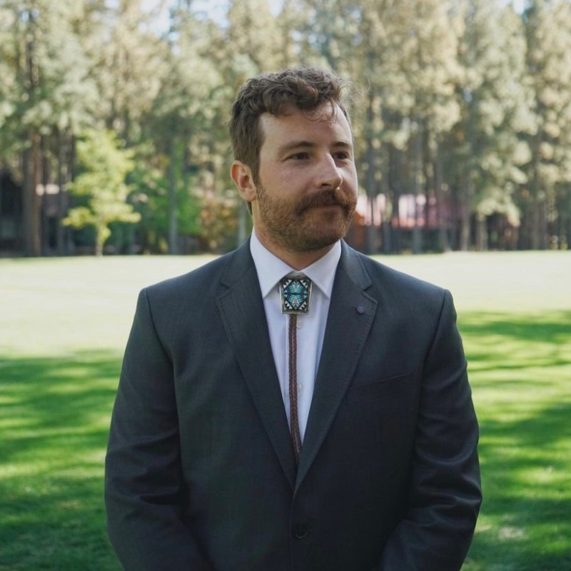

<link rel="stylesheet" href="styles.css">
# Aaron Kermes - Instructional Design Portfolio

## Welcome to My Portfolio
I'm Aaron Kermes, an instructional designer specializing in creating effective, scenario-based learning experiences for complex fields like cybersecurity. My work focuses on translating technical information into engaging, memorable content that learners can immediately apply.

My goal is to align closely with Huntress's mission to protect small and midsize businesses by creating accessible, actionable security training.
## Learn More About Me and Explore My Work

- **[About Me](about.html)**: Learn more about my background, skills, and expertise in instructional design.
- **[Projects](projects.html)**: Discover a selection of my work, including cybersecurity awareness modules and healthcare case studies.
- **[Contact](contact.html)**: Reach out to discuss potential collaborations or to learn more about my approach to instructional design.

## Core Skills
- Learning Content Writing & Script Development
- Storytelling & Engagement Strategies
- Accessibility Standards (WCAG 2.2AA)
- Cybersecurity Awareness Training
- Instructional Design Models (Action Mapping, ADDIE, SAM)
- Generative AI for Content Creation

Thank you for visiting my portfolio. Feel free to explore and reach out if you’re interested in working together!

<footer>
    
Connect with me: 
        <a href="https://linkedin.com/in/aaron-kermes" target="_blank"><i class="fab fa-linkedin"></i> LinkedIn</a> | 
        <a href="mailto:akermes@outlook.com"><i class="fas fa-envelope"></i> Email</a>
    

    
&copy; 2024 Aaron Kermes

</footer>
